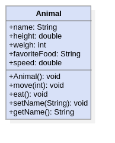
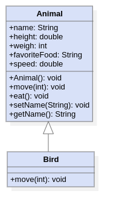
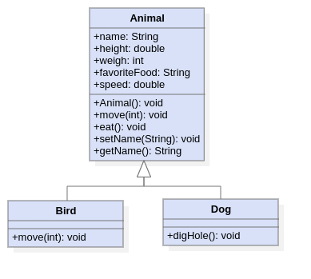

# Reviewing Basic & Advanced OOP Concepts

## What is a class?

A class is a blueprint for objects of said class.
Classes are split in two parts, fields and Methods.

### Fields (Instance Variables)

Fields are what an object of a class 'knows'.

### Methods (Functions)

Methods are what an object of a class 'does'

### Example Class 'Animal'

This is an example of a simple class which represents the blueprint for an
animal object.

## What is Inheritance?

Classes can have subclasses. A class that has a subclass becomes its superclass.

### Example Superclass 'Animal' with Subclass 'Bird'

In this example, the `Bird` subclass overrides the move method (because it moves differently).

### Superclasses

Superclasses usually hold everything that their subclasses have in common.
A good step-by-step approach to writing superclasses are the following steps.

- Figure out what classes have in common.
- Abstract out these common features.
- Override or extend methods that don't work for the subclass.

### Example Superclass 'Animal' with Subclasses 'Bird' & 'Dog'

In this example, the `Bird` subclass still overrides the move method (because it moves differently).
The `Dog` subclass extends the `Animal` superclass by adding a new `digHole()` method.
Dogs are currently the only animal that can dig holes.
