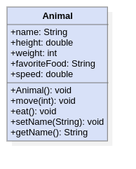
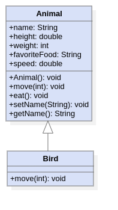

# Reviewing Basic & Advanced OOP Concepts

## What is a class?

A class is a blueprint for objects of said class.
Classes are split in two parts, fields and Methods.

### Fields (Instance Variables)

Fields are what an object of a class 'knows'.

### Methods (Functions)

Methods are what an object of a class 'does'

### Example Class 'Animal'

This is an example of a simple class which represents the blueprint for an
animal object.



## What is Inheritance?

Classes can have subclasses. A class that has a subclass becomes its superclass.

### Example Superclass 'Animal' with Subclass 'Bird'



In this example, the `Bird` subclass overrides the move method (because it moves differently).

### Superclasses

Superclasses usually hold everything that their subclasses have in common.
A good step-by-step approach to writing superclasses are the following steps.

- Figure out what classes have in common.
- Abstract out these common features.
- Override or extend methods that don't work for the subclass.

The relationship between a superclass and its subclasses is called a 'generalization'
and it is indicated by a line with an empty arrow head which points to the superclass.
The subclass 'inherits' all fields and methods from the superclass. For this reason
we call this principle 'inheritance'.

- Fields and Methods are 'carried over' from the superclass to subclasses
- Only changes are defined in the subclass (overrides and extensions)

### Example Superclass 'Animal' with Subclasses 'Bird' & 'Dog'


In this example, the `Bird` subclass still overrides the move method (because it
moves differently). The `Dog` subclass extends the `Animal` superclass by adding
a new `digHole()` method. Dogs are currently the only animal that can dig holes.

### C++ Implementation

#### Animal.cpp

```cpp
#include "Animal.h"
#include <cstdio>

/**
 * Animal implementation
 */

/**
 * @return void
 */
Animal::Animal() { return; }

/**
 * @param int
 * @return void
 */
void Animal::move(int) {
  printf("moving...\n");
  return;
}

/**
 * @return void
 */
void Animal::eat() {
  printf("eating...\n");
  return;
}

/**
 * @param String
 * @return void
 */
void Animal::setName(string newName) {
  name = newName;
  return;
}

/**
 * @return String
 */
string Animal::getName() { return name; }
```

#### Dog.cpp

```cpp
#include "Dog.h"

/**
 * Dog implementation
 */

/**
 * @return void
 */
void Dog::digHole() {
  printf("digging a hole...\n");
  return;
}
```

#### Bird.cpp

```cpp
#include "Bird.h"
#include <cstdio>

/**
 * Bird implementation
 */

/**
 * @param int
 * @return void
 */
void Bird::move(int) {
  printf("flying...\n");
  return;
}
```

## What is main for?

Main creates the objects and then they interact.

#### main.cpp

```cpp
#include "Animal.h"
#include "Bird.h"
#include "Dog.h"
#include <cstdio>

int main(int argc, char *argv[]) {
  Animal *boar = new Animal();

  boar->setName("boar");
  /* printf(boar->name); */
  printf("%s\n", boar->name.c_str());
  boar->move(2);
  boar->eat();

  Bird *bird = new Bird();
  bird->setName("birb");
  printf("%s\n", bird->name.c_str());
  bird->move(2);
  bird->eat();

  Dog *dog = new Dog();
  dog->setName("doggo");
  printf("%s\n", dog->name.c_str());
  dog->move(2);
  dog->eat();
  dog->digHole();

  return 0;
}
```
